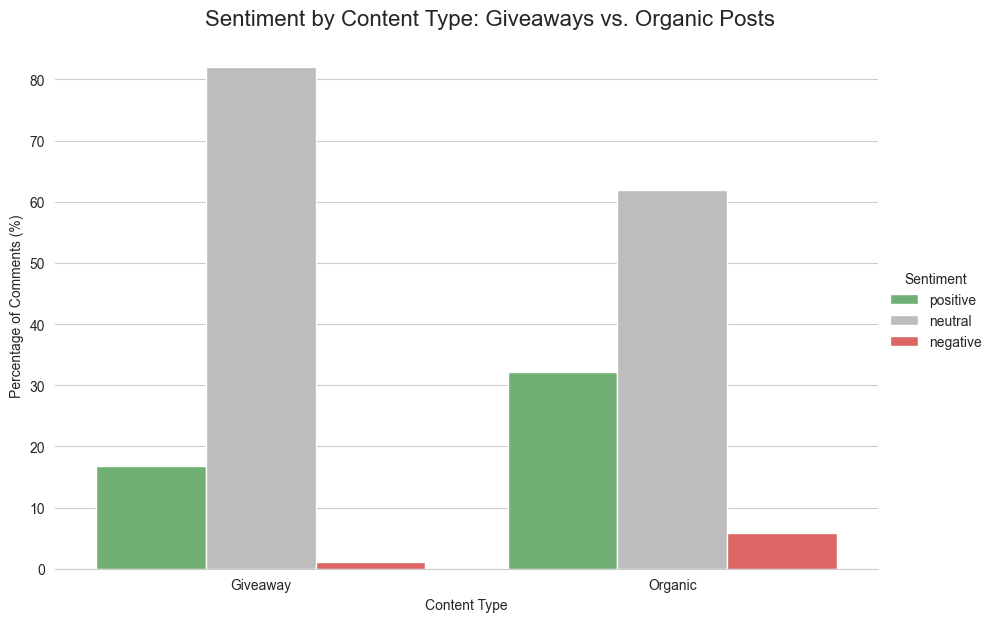
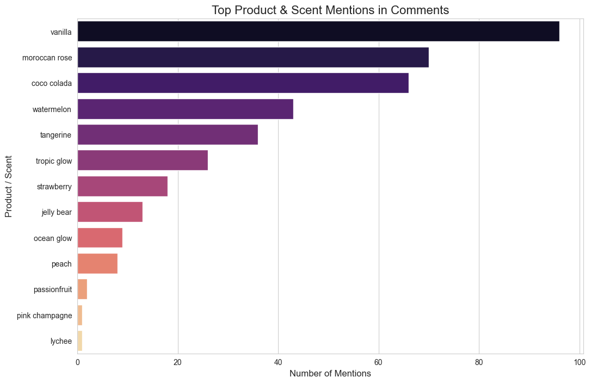
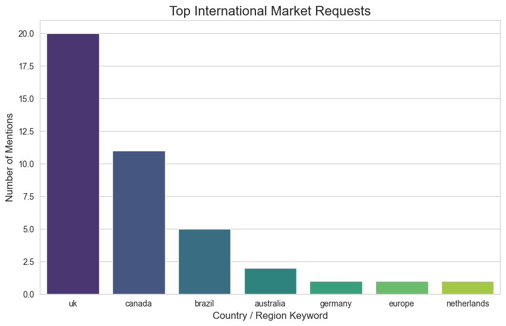

# Tree Hut Instagram Trend Analysis (March 2025)

This repository contains a metrics-driven report on consumer trends, topics of interest, and their shifts over time for the skincare brand @treehut, based on an analysis of ~18,000 Instagram comments from March 2025.

---

## Executive Summary

This report analyzes over 17,800 Instagram comments from March 2025 to extract actionable insights for Tree Hut's social media and product strategy. The analysis reveals a community whose engagement is heavily driven by promotional content, such as giveaways and PR applications.

While overall sentiment is positive, **our key finding is the critical distinction between promotional and organic content.** Organic posts, though lower in comment volume, are a far richer source of authentic product feedback, containing nearly double the rate of positive sentiment. Furthermore, we've identified a strong, recurring demand for expansion into the **UK and Canada**, and have observed that legacy scents like **Vanilla and Moroccan Rose** continue to dominate consumer conversations, while newer launches have yet to gain similar traction in user comments.

---

## Key Findings & Visualizations

### Finding 1: Organic Posts Drive Quality Feedback

Giveaways are effective for driving high comment volume, but the content is over 82% neutral (user tags, low-effort entries). Organic posts are the primary source for genuine positive and negative feedback, making them essential for understanding true customer opinion.



### Finding 2: Legacy Scents Are the Stars of the Show

Established scents like `Vanilla`, `Moroccan Rose`, and `Coco Colada` are the most-discussed products, indicating strong brand loyalty. Newer launches like `Sunlit Glow` had 0 mentions in the dataset, highlighting an opportunity to increase their visibility in organic conversations.



### Finding 3: Clear Signal for UK & Canadian Expansion

The data shows significant, repeated requests for Tree Hut to be made available in the United Kingdom and Canada. This represents a clear, data-backed opportunity for market expansion and a key pain point for international fans.



---

## Technical Setup & Instructions

This project uses `uv` for package management.

1.  **Create the virtual environment:**
    ```bash
    uv venv
    ```

2.  **Install project dependencies:**
    ```bash
    uv pip install -e ".[dev]"
    ```
    *(Note: This uses the dependencies defined in `pyproject.toml`)*.

3.  **Run the Analysis:**
    The primary analysis and report is located in `notebooks/analysis.ipynb`. Open this file in a Jupyter environment to view the code and reproduce the findings.

---

## Extension Proposal

If given a month to expand this project, I would prioritize the following features, ranked by impact:

1.  **Automated Product Request Topic Modeling:** Implement LDA or BERTopic on comments containing keywords like "request," "make," or "wish you had." This would move beyond simple keyword counting to automatically cluster and surface new scent ideas (e.g., "coffee," "lavender," "pistachio") for the product development team.
2.  **Real-Time Analytics Dashboard:** Build an interactive dashboard using Streamlit or Dash. This would allow the social media manager to filter trends by date range, product, and sentiment in real-time, enabling more agile content strategy decisions.
3.  **Competitor Mention Analysis:** Flag and analyze comments that mention competitors (e.g., "Sol de Janeiro," "First Aid Beauty"). This would provide direct, actionable insights into Tree Hut's competitive advantages and disadvantages from the customer's perspective.

---

## AI & Tool Usage Disclosure

*   **Gemini Pro 2.5 and Claude Sonnet 4:** Used as collaborative partners for project planning, strategizing the analytical approach, and assisting with code implementation and reporting.
*   **VaderSentiment Library:** A pre-trained model for sentiment analysis, chosen for its effectiveness on social media text.
*   **Seaborn/Matplotlib:** Used for data visualization to create the charts in the report.
